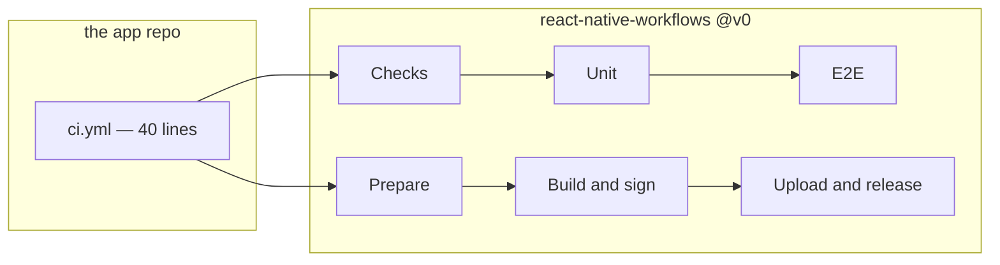

<div align="center">

# React Native Workflows

Shared GitHub Actions workflows for building, testing and releasing<br>
the team's React Native (Expo) apps.

[](https://github.com/blinkbitcoin/react-native-workflows/actions/workflows/self-ci.yml?query=branch%3Amain)
[](https://github.com/blinkbitcoin/react-native-workflows/actions/workflows/self-smoke.yml?query=branch%3Amain)
[](LICENSE)

<sub>14 reusable workflows · 79 scripts · 435 tests · one pinned tag</sub>

</div>

---

Continuous integration for a React Native app is not a config file. It is
seventy shell scripts: install an Android SDK, boot an emulator that does not
hang, wait for Metro, hash the native inputs so a build cache means something,
decode signing secrets without leaving them on disk, upload a build and then
prove that the artifact uploaded is the one that was built.

Kept here rather than copied into each app repo, where they drift apart and the
same bug gets fixed three times. An app repo carries a forty-line `ci.yml`
naming the workflows it calls; everything those workflows do lives here.



**Where to start** — three ways through this repository:

| Task | Where to look |
| --- | --- |
| **Adopting it**<br>in an app repo | [Calling it](#calling-it) — the caller to copy<br>[Pinning](#pinning) — why `@v0` moves<br>[What a consumer provides](#what-a-consumer-provides) — no secrets, two variables |
| **Debugging**<br>a red run | [Every workflow and its jobs](#every-workflow-and-its-jobs) — which job owns the failure<br>[forensics.md](docs/forensics.md) — what a failed E2E run left behind<br>[cache-keys.md](docs/cache-keys.md) — why the cache missed |
| **Changing**<br>this repo | [Repository layout](#repository-layout) — where a change belongs<br>[CONTRIBUTING.md](CONTRIBUTING.md) — worktrees, commits, what a change carries<br>[consumer-guide.md](docs/consumer-guide.md) — the contract callers rely on |

## Calling it

`.github/workflows/ci.yml` in the app repo:

```yaml
name: CI
on:
  push: { branches: [main] }
  pull_request: { types: [opened, synchronize, reopened] }
permissions:
  contents: read
concurrency:
  group: ci-${{ github.ref }}
  cancel-in-progress: ${{ github.ref != 'refs/heads/main' }}
jobs:
  checks:
    name: Checks
    uses: blinkbitcoin/react-native-workflows/.github/workflows/checks.yml@v0
  unit:
    name: Unit
    needs: checks
    if: ${{ needs.checks.outputs.docs-only != 'true' }}
    uses: blinkbitcoin/react-native-workflows/.github/workflows/unit.yml@v0
  e2e:
    name: E2E
    needs: [checks, unit]
    if: ${{ needs.checks.outputs.docs-only != 'true' }}
    uses: blinkbitcoin/react-native-workflows/.github/workflows/e2e.yml@v0
```

That is the trimmed version. The full one — `workflow_dispatch`, the `labeled`
PR type with the `ios:` expression that is the only reason to have it, the
badge job and the E2E mock-API hooks — is [the consumer guide's
`ci.yml`](docs/consumer-guide.md#consumer-ciyml). It is byte-identical to
`test/fixtures/consumer-min/`'s caller and `test/consumer-contract.bats` keeps
it that way, so the example in the docs cannot drift from the one under test.

## How a job works

Every job checks the *consumer* repo out, then checks *this* repo out into
`.workflows/` at the exact ref that defines the running job, then runs its
scripts through `$WORKFLOWS_DIR`. A caller never references anything under
`scripts/` directly, and a job can never straddle two versions of this repo.

What runs inside is the consumer's own `package.json` script wherever it has
one — `pnpm lint` belongs to the app repo — with a script here as the fallback.
CI runs what a developer runs locally, and logs which of the two it picked.

## Every workflow and its jobs

Job names are what the Actions graph shows, so they are listed here next to
what makes them fail. A consumer's run renders `<caller job name> / <job name
below>` — `Checks / Dependencies`, `E2E / Build Android`.

### On a pull request or a push

| Workflow | Jobs | Each job's responsibility |
| --- | --- | --- |
| `checks.yml` | `Changes` | Classifies the diff. Its `docs-only` output is what lets every other job skip |
| | `Code` | Typecheck, lint, format, knip, spell — the fast gates `make check-code` runs |
| | `Generated` | i18n catalogs and GraphQL codegen are committed and match their sources |
| | `Docs` | Doc freshness, command tables, table widths, mermaid blocks parse |
| | `Dependencies` | Expo SDK drift, vulnerability audit, lockfile provenance, licences |
| | `Prebuild` | Prebuilds both platforms and asserts the config plugins produced what they claim |
| | `Bundle secrets` | Exports the JS bundle and fails if a non-public key is in it |
| | `Release` | Ruby syntax, fastlane lane parse, lane unit tests — before a release needs them |
| | `Tooling` | actionlint and shellcheck over the CI itself |
| | `Commits` | commitlint over the PR's commits |
| `unit.yml` | `Tests` | Jest with coverage thresholds; uploads the coverage report |
| `e2e.yml` | `Build iOS`<br>`Build Android` | One native build each, cached on a hash of the native inputs |
| | `iOS`<br>`Android` | Boot simulator or emulator, start Metro, run the Maestro flows, collect forensics |
| `web.yml` | `Build` | Expo web export |
| | `Playwright` | The browser suite against that export |
| | `Deploy` | Publishes to GitHub Pages |
| `badges.yml` | `Publish` | Renders unit, E2E and coverage badges and pushes `gh-pages/badges/<branch>/` |
| `codeql.yml` | `Changes`<br>`Analyze` | Same docs-only classifier, then CodeQL on the consumer's query suite. Informational, never required |
| `pr-title.yml` | `Title` | Conventional Commits lint on the PR title |
| `pr-closed.yml` | `Cancel runs`<br>`Clean badges` | Cancels the closed PR's in-flight runs, deletes its badge directory |

### On the way to a store

| Workflow | Jobs | Each job's responsibility |
| --- | --- | --- |
| `expo-prepare.yml` | `Prepare` | Resolves version and build number, fingerprints the native inputs,<br>writes `build-info.json` and store notes as one `release-meta` artifact.<br>Optionally blocks until a named CI workflow is green for the sha |
| `expo-build-ios.yml` | `Build` | Prebuild, pods, `fastlane ios build` then `verify`; uploads the IPA and dSYMs |
| `expo-build-android.yml` | `Build` | Prebuild, `fastlane android build` then `verify`; uploads the AAB, APK and mapping |
| `fastlane-lane.yml` | *named for its inputs* | One lane — upload, promote, staged rollout, halt. The job takes<br>the lane's name so four operations do not look identical in the graph |
| `github-release.yml` | `Release` | Creates or moves a release with a fixed asset set and `SHA256SUMS`; `promote` carries a pre-release's assets forward |
| `expo-ota-publish.yml` | `Publish` | Compares fingerprints and publishes an OTA update only when the native side is unchanged |

### This repo's own

| Workflow | Jobs | Each job's responsibility |
| --- | --- | --- |
| `self-ci.yml` | `Check` | actionlint, shellcheck, the bats suite, version agreement, spell |
| | `Parity` | Checks this repo against a real consumer checkout: the guide's examples, the fixture and the template must agree |
| | `PR title` | Conventional Commits, on itself |
| `self-smoke.yml` | `Checks`<br>`Unit`<br>`E2E` | Runs the family against a real consumer repo. Weekly, and on dispatch |
| `self-release.yml` | `Release PR` | release-please opens and maintains the version PR |
| | `Major tag` | On release, re-points `v0` and `v0.1` at the new tag |

## Repository layout

| Path | Responsibility |
| --- | --- |
| `.github/workflows/` | The 17 workflows above. Thin: a workflow wires inputs and calls a script |
| `.github/actions/` | Five composite actions — `setup`, `maestro`, `native-key`, `free-disk`, `forensics` — the steps repeated across workflows |
| `scripts/checks/` | One gate each: audit, codegen, commitlint, expo-doctor, i18n.<br>Plus `run-script.sh` and `run-consumer-or.sh`, which decide<br>between the consumer's script and this repo's |
| `scripts/ci/` | Runner plumbing: Android SDK, KVM, disk pressure, pnpm store, badges, cancel-runs, tool versions |
| `scripts/e2e/` | The E2E machine: simulator and emulator boot, Metro start and wait, Maestro run, timeouts, forensics collection |
| `scripts/native/` | Prebuild, pods, and the iOS and Android build and packaging steps |
| `scripts/release/` | Version resolution, fingerprints, build info, store notes,<br>release assets and hashes, secret decoding, the green-run gate |
| `scripts/ota/` | Fingerprint baseline and gate, export, publish, smoke |
| `scripts/web/` | Expo web export, Playwright install, cache keys, run |
| `scripts/lib/` | Shared bash: common helpers, env building and validation, git cleanliness, the single pinned tool-version table |
| `scripts/self/` | This repo's own upkeep: version agreement, moving the major tag |
| `test/` | 51 bats files, 435 tests, plus `fixtures/consumer-min/` — the caller the docs are held to |
| `docs/` | The consumer guide and the three explainers |

## Pinning

Pin `@v0`. It is a moving tag that `self-release.yml` re-points at each
release, so fixes arrive without editing eleven caller files, and a breaking
change arrives as `@v1` rather than as a red build on a Monday morning. Pin a
full version instead when every change should be reviewed before it lands —
[Versioning](docs/consumer-guide.md#versioning) covers both.

## What a consumer provides

**No secrets.** Every workflow here runs on `github.token`. Store credentials
only ever enter the release workflows a repo chooses to call, from that repo's
own secrets.

Two repo variables are worth setting. `E2E_IOS=true` runs the iOS suite on
every push — macOS runners bill at ten times the Linux rate, so it is opt-in
per repo, and a single PR can have it with an `e2e:ios` label instead.
`WORKFLOWS_MACOS_RUNNER` moves iOS off `macos-26` onto another label or a
self-hosted box.

Two optional secrets. `RELEASE_PLEASE_TOKEN`, because a PR opened with
`github.token` does not trigger CI, and release PRs should be checked before
merge. And `consumer-token`, only when the smoke target is private.

## Documentation

[**Consumer guide**](docs/consumer-guide.md) is the contract: every input,
output and secret, the full caller examples, and the gotchas encoded here so
they do not have to be rediscovered. The rest explain the parts that surprise
people — [**cache keys**](docs/cache-keys.md) (what invalidates a cache),
[**forensics**](docs/forensics.md) (what a failed E2E run leaves behind),
[**runners**](docs/runners.md) (labels, billing, KVM, disk).

[`blinkbitcoin/react-native-mobile-template`](https://github.com/blinkbitcoin/react-native-mobile-template)
is the app repo these were built for, and the worked example of every caller.

## Licence

MIT — see [LICENSE](LICENSE).
