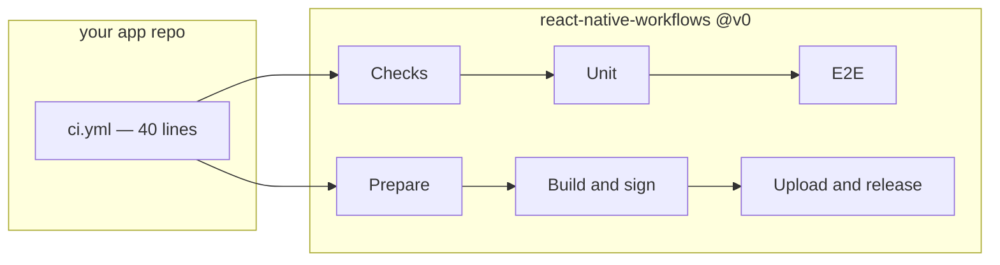

<div align="center">

# React Native Workflows

**The CI your app repo does not have to write.**<br>
Reusable GitHub Actions workflows for building, testing and shipping
Expo apps — 14 workflows, 79 scripts, 435 tests, one pinned tag.

</div>

---

Continuous integration for a React Native app is not a config file. It is
seventy shell scripts: install an Android SDK, boot an emulator that does not
hang, wait for Metro, hash the native inputs so a build cache means something,
decode signing secrets without leaving them on disk, upload a build and then
prove the thing you uploaded is the thing you built.

Every app repo writes them, each one slightly differently, and then fixes the
same bug three times. They live here instead. Your app repo gets a forty-line
`ci.yml` that names the workflows it wants.



## Calling it

`.github/workflows/ci.yml` in your app repo:

```yaml
name: CI
on:
  push: { branches: [main] }
  pull_request: { types: [opened, synchronize, reopened] }
permissions:
  contents: read
concurrency:
  group: ci-${{ github.ref }}
  cancel-in-progress: ${{ github.ref != 'refs/heads/main' }}
jobs:
  checks:
    name: Checks
    uses: blinkbitcoin/react-native-workflows/.github/workflows/checks.yml@v0
  unit:
    name: Unit
    needs: checks
    if: ${{ needs.checks.outputs.docs-only != 'true' }}
    uses: blinkbitcoin/react-native-workflows/.github/workflows/unit.yml@v0
  e2e:
    name: E2E
    needs: [checks, unit]
    if: ${{ needs.checks.outputs.docs-only != 'true' }}
    uses: blinkbitcoin/react-native-workflows/.github/workflows/e2e.yml@v0
```

That is the trimmed version. The full one — `workflow_dispatch`, the `labeled`
PR type with the `ios:` expression that is the only reason to have it, the
badge job and the E2E mock-API hooks — is [the consumer guide's
`ci.yml`](docs/consumer-guide.md#consumer-ciyml). It is byte-identical to
`test/fixtures/consumer-min/`'s caller and `test/consumer-contract.bats` keeps
it that way, so the example in the docs cannot drift from the one under test.

## How a job works

Every job checks *your* repo out, then checks *this* repo out into
`.workflows/` at the exact ref that defines the running job, then runs its
scripts through `$WORKFLOWS_DIR`. You never reference anything under `scripts/`
yourself, and a job can never straddle two versions of this repo.

What runs inside is your own `package.json` script wherever you have one —
`pnpm lint` is yours, not ours — with a script here as the fallback. CI runs
what you run locally, and says in the log which of the two it picked.

## The workflows

**On a pull request or a push**

| Workflow | Does |
| --- | --- |
| `checks.yml` | Typecheck, lint, format, knip, spell, i18n and codegen drift, expo-doctor, audit, actionlint, shellcheck, commitlint — each a toggle — plus the docs-only classification the other jobs gate on |
| `unit.yml` | Jest with coverage upload |
| `e2e.yml` | Maestro against cached iOS simulator and Android emulator builds |
| `web.yml` | Expo web export, Playwright, GitHub Pages deploy |
| `badges.yml` | Per-branch CI badges, published to `gh-pages/badges/<branch>/` |
| `codeql.yml` | CodeQL advanced setup on your query suite; informational, never a required check |
| `pr-title.yml` | Conventional Commits lint on the PR title |
| `pr-closed.yml` | Cancels a closed PR's in-flight runs and drops its badge directory |

**On the way to a store**

| Workflow | Does |
| --- | --- |
| `expo-prepare.yml` | Resolves version and build number, fingerprints the native inputs, writes `build-info.json` and store notes as one `release-meta` artifact |
| `expo-build-ios.yml` | Prebuild, pods, `fastlane ios build` and `verify`; uploads the IPA and dSYMs |
| `expo-build-android.yml` | Prebuild, `fastlane android build` and `verify`; uploads the AAB, APK and mapping |
| `fastlane-lane.yml` | One named lane: store upload, promote, staged rollout, halt |
| `github-release.yml` | Creates or moves a release with a fixed asset set and `SHA256SUMS`; `promote` carries a pre-release's assets forward |
| `expo-ota-publish.yml` | Fingerprint-gated OTA export and publish, opt-in through `ota-enabled` |

**This repo's own** — `self-ci.yml` (actionlint, shellcheck, bats, version
agreement, spell), `self-smoke.yml` (the whole family against a real consumer,
weekly and on dispatch), `self-release.yml` (release-please, then moves the
major tag).

## Pinning

Pin `@v0`. It is a moving tag that `self-release.yml` re-points at each
release, so you take fixes without editing eleven caller files, and a breaking
change arrives as `@v1` rather than as a red build on a Monday morning. Pin a
full version instead if you would rather approve every change yourself —
[Versioning](docs/consumer-guide.md#versioning) covers both.

## What it needs from you

**No secrets.** Every workflow here runs on `github.token`. Store credentials
only ever enter the release workflows you choose to call, from your own repo's
secrets.

Two repo variables are worth setting. `E2E_IOS=true` runs the iOS suite on
every push — macOS runners bill at ten times the Linux rate, so it is opt-in
per repo, and a single PR can have it with an `e2e:ios` label instead.
`WORKFLOWS_MACOS_RUNNER` moves iOS off `macos-26` onto another label or a
self-hosted box.

Two optional secrets. `RELEASE_PLEASE_TOKEN`, because a PR opened with
`github.token` does not trigger CI and you probably want release PRs checked.
And `consumer-token`, only if your smoke target is private.

## Documentation

[**Consumer guide**](docs/consumer-guide.md) is the contract: every input,
output and secret, the full caller examples, and the gotchas encoded here so
you do not have to rediscover them. The rest explain the parts that surprise
people — [**cache keys**](docs/cache-keys.md) (what invalidates a cache),
[**forensics**](docs/forensics.md) (what a failed E2E run leaves behind),
[**runners**](docs/runners.md) (labels, billing, KVM, disk).

[`blinkbitcoin/react-native-mobile-template`](https://github.com/blinkbitcoin/react-native-mobile-template)
is the app repo these were built for, and the worked example of every caller.

## Licence

MIT — see [LICENSE](LICENSE).
